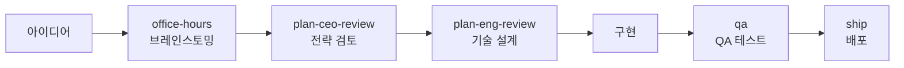
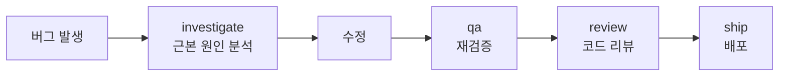

# 워크플로우

gstack 스킬은 혼자 쓸 수도 있지만, 순서대로 쓸 때 진짜 위력이 나옵니다.

## 새 기능 개발

아이디어에서 배포까지 전체 흐름.

### 각 단계에서 하는 일

| 단계 | 스킬 | 핵심 질문 |
|------|------|----------|
| 브레인스토밍 | `/gstack-office-hours` | 이게 진짜 만들 가치가 있나? |
| 전략 검토 | `/gstack-plan-ceo-review` | 범위가 맞나? 빌드/바이/킬? |
| 기술 설계 | `/gstack-plan-eng-review` | 어떻게 만드나? 리스크는? |
| 구현 | — | 코드 작성 |
| QA | `/gstack-qa` | 동작하나? 버그 있나? |
| 배포 | `/gstack-ship` | PR 만들고 내보내기 |

---

## 버그 수정

무언가 깨졌을 때의 빠른 경로.

### 각 단계에서 하는 일

| 단계 | 스킬 | 핵심 질문 |
|------|------|----------|
| 원인 분석 | `/gstack-investigate` | 왜 깨졌나? 어디서? |
| 수정 | — | 코드 수정 |
| 재검증 | `/gstack-qa` | 수정 후 사이드 이펙트 없나? |
| 코드 리뷰 | `/gstack-review` | 수정 방식이 맞나? |
| 배포 | `/gstack-ship` | PR 만들고 내보내기 |

---

## 팁

**버그가 발생했을 때 `/gstack-qa`를 바로 실행하지 마세요.** QA는 전체 사이트를 테스트합니다. 특정 버그를 추적할 때는 `/gstack-investigate`가 훨씬 빠릅니다.

**기능 개발 중간에 디자인 이슈가 발견되면** `/gstack-design-review`를 추가로 실행할 수 있습니다. 워크플로우는 선형이지 않습니다.

**체크포인트 저장은 언제든:** 세션을 닫기 전에 `/gstack-checkpoint`로 현재 상태를 저장해두면 다음 세션에서 이어받을 수 있습니다.
